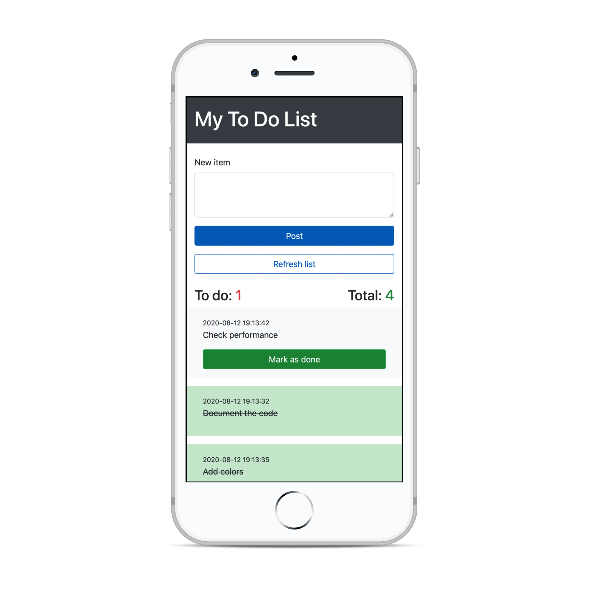
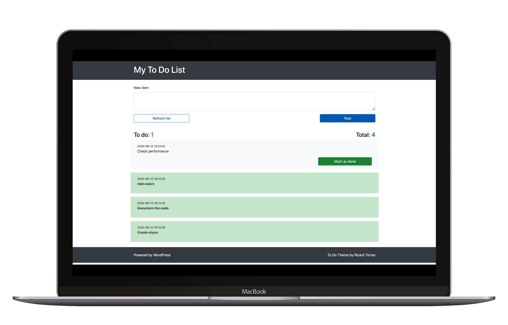

## To Do WordPress Theme

A To Do list functionality with posts.

- Frontend form to publish items (stored as "posts" in the database).
- Mark items as done.
- No single view.
- No archive view.
- No pagination.

## Development

Install dependencies:

```npm i```

Build JS and CSS for production:

```npm run build```

Watch for the changes on JS and SCSS files and build everything:

```npm run watch```

## Screenshot




